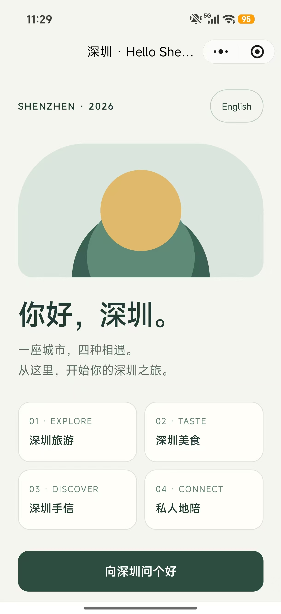

# APEC26 首次走通微信小程序 CI 上传与 H5 真机加载

记录日期：2026-10-09（America/Los_Angeles）

方案：小程序壳 + `web-view` + `miniprogram-ci`

本次成功开发版本：`0.1.2`

状态：CI 预览、开发版上传及微信真机 H5 加载已走通；用户已提供成功截图并确认页面效果。

## 1. 本次完成到哪里

这次先做独立的极简 HTML5 页面，验证托管、域名、小程序入口、代码上传密钥和 CI 上传链路。原有 APEC26 旅游攻略继续使用原入口，未切换为小程序中的正式业务内容。

| 环节 | 结果及依据 |
|---|---|
| 静态 H5 部署 | 已完成；本地文件、服务器文件、HTTPS 响应 SHA-256 一致 |
| 浏览器页面验证 | 中英切换、点击问好及 320／390／1440px 布局检查通过 |
| 小程序源码与编译包检查 | 六组本地测试通过；实际编译包包含注册入口与八个壳文件 |
| 官方 CI 预览 | 成功生成二维码，入口为 `pages/home/home` |
| 官方 CI 开发版上传 | `0.1.0`、`0.1.1`、`0.1.2` 先后上传成功；当前应使用 `0.1.2` |
| 域名校验文件 | 已放在站点根；两个域名均可访问，响应与原文件逐字节一致 |
| 微信真机 H5 加载 | 用户截图确认中文首页正常展示 |
| 真机中英切换、问好交互 | 页面效果已确认，但未逐项收到真机交互测试结果；浏览器已测 |
| 微信分享与语言还原 | 实现及本地测试已完成，接收方真机打开仍待验证 |
| 设置体验版 | 未在本轮直接操作后台；用户最终扫码所用版本渠道未独立核对 |
| 提交审核、正式发布 | 本轮未执行，不能把 CI 上传成功视为审核通过或正式上线 |

成功截图存于文档目录，不部署到公网网站：



截图可见微信小程序顶部菜单、中文标题、English 切换入口、四个静态栏目及“向深圳问个好”按钮。截图证明页面能够加载与显示，不单独证明所有按钮和分享功能均已实测。

## 2. 固定配置与地址

| 项目 | 本次实际值 |
|---|---|
| 本地仓库 | `/Users/kk/Work/GameAI` |
| 子项目 | `/Users/kk/Work/GameAI/apec26` |
| AppID（公开标识） | `wxc3765635c190d693` |
| 中文 H5 | `https://g.ismayday.mobi/apec26/wechat-demo/` |
| 英文 H5 | `https://g.ismayday.mobi/apec26/wechat-demo/?lang=en` |
| 原有攻略入口 | `https://g.ismayday.mobi/apec26/` |
| 小程序页面 | `pages/home/home` |
| SSH | `ubuntu@211.159.177.55` |
| H5 部署目录 | `/www/wwwroot/g.ismayday.mobi/apec26/wechat-demo/` |
| 两个域名共用根目录 | `/www/wwwroot/g.ismayday.mobi` |
| 校验文件公网地址 | `https://g.ismayday.mobi/fgvFAkRIrb.txt`、`https://g.ismayday.com/fgvFAkRIrb.txt` |
| CI SDK | `miniprogram-ci@2.1.31`，依赖及 lockfile 位于 `tools/mp-ci/` |
| CI 机器人 | `1` |
| 上传密钥本地路径 | `/Users/kk/Work/GameAI/apec26/SecKey/private.wxc3765635c190d693.key` |

页面路径不是网页 URL。后台“页面路径（选填）”使用 `pages/home/home`，不加扩展名；源码中的分享路径为 `/pages/home/home?lang=zh` 或 `?lang=en`。这两个位置的斜杠形式按各自代码和后台约定保留，不混填。

本轮使用已有 AppID，早期错误页显示其已有名称“AI穿搭-衣运智搭…”。这是账号后台身份信息，不能仅靠替换 H5 内容改变；正式旅游产品使用前应核对账号名称、主体及服务定位。

## 3. 代码结构与职责

```text
apec26/
├── public/wechat-demo/index.html       # 独立 H5，CSS/JS 内联
├── mp/
│   ├── project.config.json             # AppID、编译类型、根目录、域名检查
│   ├── app.js                          # App({})
│   ├── app.json                        # 注册唯一首页
│   ├── sitemap.json                    # 测试壳不开放搜索索引
│   └── pages/home/
│       ├── home.js                     # 固定 H5 地址、语言、错误与分享
│       ├── home.json                   # 页面配置
│       ├── home.wxml                   # web-view 与原生错误页
│       └── home.wxss                   # 原生错误页样式
├── tools/mp-ci/
│   ├── package.json / package-lock.json
│   ├── index.cjs                       # check / prepare / preview / upload
│   └── test.cjs                        # 六组本地测试
├── scripts/deploy-wechat-demo.sh       # 仅部署测试 H5
├── release-files.json                  # 网站明确发布清单，现含测试页
├── docs/WECHAT_RELEASE.md              # 日常操作手册
├── docs/WECHAT_FIRST_SUCCESS.md        # 本次完整记录
├── SecKey/                            # 本地上传密钥，Git 忽略
└── output/wechat-ci/                   # 临时项目、编译包、预览码，Git 忽略
```

H5 仅包含中英切换、四个静态栏目、问好计数及运行环境提示，没有登录、定位、支付、预订或第三方资源。图形由 CSS 绘制，目的是降低首次流程验证的依赖数量。

壳固定加载本项目 HTTPS 地址，只接受 `lang=en` 或默认 `zh`；当前附带 `mpbuild=0.1.2` 供定位版本。`src` 准备好后才挂载 `web-view`，加载失败显示目标地址、构建号及微信提供的错误字段，重试时增加 `retry` 参数。分享时仅从自己的 H5 URL 提取语言，不接受外部传入 URL 作为跳转目标。

CI 工具把明确列出的八个文件复制到隔离临时目录，再创建官方 SDK 的 `Project`。每次预览和上传前先调用 `getCompiledResult`，检查实际包的文件集合、`app.json` 页面注册及入口 `web-view` 模板；通过后才远程预览或上传。工具不会提交审核或发布正式版。

## 4. 后台准备：三种配置不要混淆

### 4.1 代码上传密钥

在该 AppID 的“开发管理 → 开发设置 → 小程序代码上传”生成并下载 `private.<appid>.key`，供 `miniprogram-ci` 签名上传。

- AppID 是公开账号标识；上传密钥是本机文件；AppSecret 是另一种凭据，不能替代上传密钥。
- 本流程不使用 AppSecret，文档和代码中不保存其内容。
- 当前密钥文件权限为 `600`，`SecKey/` 与 `*.key` 已被 Git 忽略。
- 工具会拒绝公开网页目录、壳打包目录中的密钥，也会拒绝仓库内已跟踪或未忽略的密钥。
- 曾在聊天提供的 AppSecret 应由管理员重置；本记录不表示重置已完成。

### 4.2 CI 公网 IP 白名单

这项限制检查运行上传命令的机器公网出口。本次在 Mac 运行 CI，错误返回 `36.112.24.8`，不是网页服务器 `211.159.177.55`。

首次请求返回 `errCode -10008 / invalid ip: 36.112.24.8`。用户随后关闭了代码上传 IP 白名单限制，重试预览与上传成功。后续如重新启用白名单，应配置实际运行 CI 的出口 IP；网络变化后重新核对，不沿用历史 IP 当作永久值。

### 4.3 业务域名

`web-view` 加载网页需要独立的“业务域名”配置。本次最关键的后台问题是：用户起初只在“服务器域名 → request 合法域名”配置了 `g.ismayday.mobi`。

| 配置 | 对应用途 | 能否替代本次业务域名配置 |
|---|---|---|
| 服务器域名 / request 合法域名 | 小程序请求接口 | 不能 |
| 业务域名 | `web-view` 网页访问 | 本次需要 |
| 小程序代码上传 IP 白名单 | 限制 CI 代码上传来源 | 不能 |

应在同一 AppID 的“开发管理 → 开发设置 → 业务域名”添加 `g.ismayday.mobi`，按后台提示校验并保存。`g.ismayday.com` 的校验文件也已就绪；当前壳实际使用 `.mobi`。两个 URL 可访问并不等于能从服务器端读出后台已保存的完整域名列表，后台配置状态仍以管理员界面为准。

## 5. 域名根目录校验文件的实际部署

用户明确授权把 `/Users/kk/Downloads/fgvFAkRIrb.txt` 放到两个域名根目录。读取 Nginx 配置后确认两个域名的 `root` 均为 `/www/wwwroot/g.ismayday.mobi`，因此只需上传一份，不创建不存在的 `/www/wwwroot/g.ismayday.com`。

文件信息：32 字节；SHA-256 为：

```text
fcc8ccf72ce7860e2f3f43e97b8ecf3b18fd63b036375b81e75ce3620e957dc5
```

实际操作先确认目标文件不存在并执行 dry-run，再上传单个文件；文件属主 `www:www`、权限 `644`。没有修改 Nginx，也没有同步或删除整个站点根目录。

复用命令前，必须先确认新文件名、授权范围及两个域名的实际 `root`：

```bash
rsync -avzn --checksum --rsync-path='sudo rsync' \
  --no-owner --no-group --no-perms --chmod=F644 \
  /Users/kk/Downloads/fgvFAkRIrb.txt \
  ubuntu@211.159.177.55:/www/wwwroot/g.ismayday.mobi/fgvFAkRIrb.txt

# 核对 dry-run 后执行；不带 --delete
rsync -avz --checksum --rsync-path='sudo rsync' \
  --no-owner --no-group --no-perms --chmod=F644 \
  /Users/kk/Downloads/fgvFAkRIrb.txt \
  ubuntu@211.159.177.55:/www/wwwroot/g.ismayday.mobi/fgvFAkRIrb.txt

ssh ubuntu@211.159.177.55 \
  'sudo chown www:www /www/wwwroot/g.ismayday.mobi/fgvFAkRIrb.txt && sudo chmod 644 /www/wwwroot/g.ismayday.mobi/fgvFAkRIrb.txt'
```

公网验证结果：

| 请求 | 结果 |
|---|---|
| `https://g.ismayday.mobi/fgvFAkRIrb.txt` | 200，32 字节，与本地相同 |
| `http://g.ismayday.mobi/fgvFAkRIrb.txt` | 跳转到 HTTPS，最终 200，内容相同 |
| `https://g.ismayday.com/fgvFAkRIrb.txt` | 200，32 字节，与本地相同 |
| `http://g.ismayday.com/fgvFAkRIrb.txt` | 200，内容相同 |

校验文件放在域名根，不放在 `/apec26/` 或 `/apec26/wechat-demo/`。它是域名验证材料，不是代码上传私钥。

## 6. 可重复执行的开发与提交流程

以下命令均从仓库根目录运行。当前版本是 `0.1.2`；下一次壳改动可使用 `0.1.3`，执行前更新实际版本与描述。

### 6.1 安装与本地检查

```bash
cd /Users/kk/Work/GameAI
npm --prefix apec26/tools/mp-ci ci --ignore-scripts --no-audit --no-fund
npm --prefix apec26/tools/mp-ci test
node apec26/tools/mp-ci/index.cjs check
python3 apec26/scripts/check-release.py
```

本次在 Node.js `26.4.0` 上完成了实际编译与上传。SDK 出现过 experimental localStorage 提示，未阻止成功；后续使用 Node.js LTS 时仍需运行检查，不能据此推定任意运行时都兼容。SDK 安装在工具目录，不放进小程序八文件壳中，也不需要对壳执行“构建 npm”。

六组测试覆盖参数与上传版本、隔离项目文件集合、密钥权限与失败拦截、实际编译包校验、固定地址及分享语言、`src` 就绪后挂载。测试用临时凭据不会进入项目发布内容。

### 6.2 发布 H5

```bash
bash apec26/scripts/deploy-wechat-demo.sh --dry-run
bash apec26/scripts/deploy-wechat-demo.sh --apply
```

脚本先检查发布清单与壳配置，只上传 `public/wechat-demo/index.html`，不使用 `--delete`，再校验本地、服务器与线上响应摘要。本次测试页作为第 79 个网站文件加入明确发布清单，原有 78 个网页文件内容保持不变。

### 6.3 设置本机凭据

```bash
export WX_MP_APPID='wxc3765635c190d693'
export WX_MP_PRIVATE_KEY_PATH='/Users/kk/Work/GameAI/apec26/SecKey/private.wxc3765635c190d693.key'
export WX_MP_ROBOT='1'
chmod 600 "$WX_MP_PRIVATE_KEY_PATH"
node apec26/tools/mp-ci/index.cjs check --credentials
```

`check --credentials` 验证本地文件格式、权限及 Git 排除，不验证远程白名单和业务域名。不要把密钥内容或 AppSecret 写入命令、日志或文档。

### 6.4 生成预览并真机验收

```bash
node apec26/tools/mp-ci/index.cjs preview --desc 'APEC26 微信真机测试'
```

输出顺序为：本地检查 → 隔离项目路径 → 编译包检查 → 编译包审计路径 → 新预览二维码路径。用管理员或有权限的开发者微信扫描最新二维码；不把历史预览图片作为长期入口。二维码不可用时重新生成，不复用过期码。

如需导入微信开发者工具，可打开 `apec26/mp/`，或执行 `node apec26/tools/mp-ci/index.cjs prepare` 后打开输出的隔离目录。`prepare` 不上传。

### 6.5 上传开发版本

```bash
node apec26/tools/mp-ci/index.cjs upload \
  --version 0.1.2 \
  --desc '深圳 H5 最小流程测试，入口 pages/home/home'
```

执行前使用本次实际新版本，不重复把 `0.1.2` 当作后续版本。壳中 `home.js` 的 `BUILD` 与 CI 的 `--version` 分别设置，工具不自动同步；修改壳时应保持两者一致，方便识别手机加载版本。工具自身 `package.json` 的 `0.1.0` 是工具版本，不代表已上传小程序版本。

上传成功后，管理员在该 AppID 后台“版本管理”确认版本号与描述，再按需要设置体验版、添加体验成员。后台页面路径填写 `pages/home/home`，或留空使用已注册首页。体验验收后另行提交审核；审核和正式发布不由当前脚本执行。

## 7. 三轮排错记录

| 阶段 | 现象 | 检查与结论 | 处理及结果 |
|---|---|---|---|
| 首次 CI | `invalid ip: 36.112.24.8` | 代码已编译，请求被代码上传 IP 限制拦截 | 用户关闭该限制；之后预览和上传成功 |
| `0.1.0` | 微信黑色“页面不存在”页 | 后台入口为 `pages/home/home`，实际编译包仅注册 `pages/index/index` | 统一代码、预览与分享入口，上传 `0.1.1` |
| `0.1.1` | 已出现本项目浅色“页面暂时无法打开”错误页 | 原生入口已修复；H5 HTTP 200、TLS 1.2 正常；所查近期访问日志未见手机请求；用户确认只配置服务器域名 | 添加业务域名并部署根校验文件；`0.1.2` 增加加载保护和错误详情；随后用户截图确认 H5 正常显示 |

第二轮“页面不存在”和第三轮“网页无法加载”属于不同层级。看到本项目原生错误页时，说明原生页面已经进入，优先核对业务域名、网页地址和真实错误字段，而不是再次盲目修改页面路径。

`0.1.2` 同时增加了 `src` 就绪检查，但本轮没有单独实验隔离它与后台域名配置的影响；已确认的配置错误是缺少业务域名，不把所有修复都描述为经独立验证的根因。

工具层还处理了 SDK 编译 worker 在远程操作完成后保留进程的问题：一次性 CLI 在已等待操作完成后显式退出。后续命令已正常退出；不是以终止进程代替等待上传结果。

## 8. 本次输出与证据位置

| 输出 | 路径（相对 apec26） | 说明 |
|---|---|---|
| `0.1.0` 预览 | `output/wechat-ci/preview-1791601346937.png` | 历史入口，勿继续使用 |
| `0.1.1` 预览 | `output/wechat-ci/preview-1791601976601.png` | 页面入口修复后生成 |
| `0.1.2` 预览 | `output/wechat-ci/preview-1791602410460.png` | 本轮最终生成的预览；有效性以实际扫码为准 |
| `0.1.2` 编译审计 | `output/wechat-ci/compiled-1791602408220.zip` | 检查过八文件与注册入口 |
| 成功截图 | `docs/assets/wechat-first-success-2026-10-09.jpg` | 用户提供，随文档保留 |
| 日常手册 | `docs/WECHAT_RELEASE.md` | 按后续实际版本维护 |

`output/` 是本地忽略目录，不保证其他开发者 checkout 后存在；可用已记录命令重新生成。SDK 生成 zip 的条目可能带 `./` 前缀，人工核对时先统一路径形式，避免把相同入口误判为缺失。

首次成功记录整理时尚未创建 Git 提交或推送。用户随后授权将 demo、CI 工具、流程文档及成功截图一起提交和推送；密钥、依赖目录及临时输出继续排除。提交保留用户作者／提交者配置，追加 `Co-authored-by: Codex <codex@openai.com>`。实际提交号以 Git 历史为准。

## 9. 后续迭代如何选择发布动作

| 改动 | 发布方式与检查重点 |
|---|---|
| 固定 URL 下的 H5 文案、样式、交互 | 部署对应网页，检查资源版本与微信缓存；通常不因这些文件本身重传壳，正式业务内容仍按平台要求管理 |
| 壳目标地址、原生页面路径、分享、失败页 | 修改壳并运行测试，更新 `BUILD`，生成预览、上传新开发版本，再做真机验收 |
| 切到正式旅游攻略入口 | 核对新页面所有导航、外链、资源和微信内行为；更新固定地址及工具检查，验证后上传新壳 |
| 新域名或跨域网页跳转 | 先核对该 AppID 业务域名与校验要求，再改代码；接口域名配置不能替代 |
| 新机器、CI 执行环境或网络 | 配置受保护上传密钥、锁定依赖、检查出口 IP 和权限，再执行预览 |
| 正式发布 | 补齐体验、分享、不同设备及账号信息检查后，由管理员提交审核与发布 |

后续首次完整验收至少记录：真机中英切换、问好计数、退出后重新进入、接收方打开分享链接及语言还原、体验成员访问、另一系统设备表现。截图确认加载成功后，不应把这些未单独记录的项目自动标为通过。

## 10. 官方参考与操作手册

- [微信 miniprogram-ci](https://developers.weixin.qq.com/miniprogram/dev/devtools/ci.html)
- [微信 web-view 组件](https://developers.weixin.qq.com/miniprogram/dev/component/web-view.html)
- [微信域名配置说明](https://developers.weixin.qq.com/miniprogram/dev/framework/ability/domain.html)
- [本项目日常微信流程说明](WECHAT_RELEASE.md)

本文记录的是本次实际操作及验证结果。微信后台菜单、权限和平台规则发生变化时，以对应 AppID 后台及官方文档为准，并更新操作手册。
