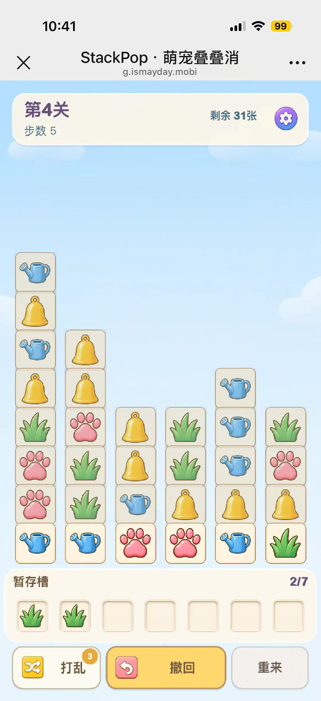

# StackPop UI-R2 精细化建议（iPhone 真机 V1）

> 日期：2026-08-23  
> 用途：供 Kevin、Claude、Codex 对齐 R1 之后的 UI 精修方向；不是已批准的执行规格。  
> 证据：iPhone 内置浏览器，L4、步数 5、Tray 2/7。  
> 原图：1206×2622，SHA-256 `65358f553f1b1517838d5a325af08790dda037cc04deaa025dbddcdffccc93fd`。

## 0. 真机证据

截图文件：`docs/audit-assets/02-iphone-r1-level4-step5-tray2-20260823.jpg`

顶部白色区域属于手机内置浏览器，不属于游戏 UI。按 3× 屏估算，游戏实际可视区约
402×773 CSS px；本轮只审计蓝色游戏画布内的内容。

## 1. 结论先行

R1 的结构调整是成功的：图案尺寸恢复、底部基线成立、Tray 层级清楚、撤回成为主操作，
真机上没有裁切或模糊。当前问题已经从“哪里不对”变成了“所有组件都还差最后一层材质、
状态和细节统一”。

建议 R2 不再改关卡、Tile 尺寸、底部基线和主要区域位置，而是集中做四个组件族：

1. HUD 从“大白框”精修为轻盈的游戏状态条；
2. 三个工具按钮统一材质，同时把主次做得更自然；
3. Tray 强化“容器”和“已有牌组”的细节，不增加一层卡框；
4. 棋盘区把“可点 / 被覆盖”的差异从整体变灰，升级为阴影、亮度和层次差异。

这轮应先做纯代码视觉参数版，不急着开新美术工单。现有素材质量足够，主要差距在渲染方式。

## 2. 当前已经成立的部分

### 2.1 信息架构正确

- HUD、棋盘、Tray、工具栏四区一眼可分；
- “剩余 31张”和“步数 5”没有重复信息；
- Tray 的 `2/7` 靠近槽位，位置正确；
- 撤回最宽、最亮，重来被弱化，操作优先级正确。

### 2.2 R1 图案比例修正有效

棋盘图案现在有实体感，不再像小贴纸。铃铛、浇水壶、草、爪印在真机尺寸下均能快速区分。
R2 不应再缩小图案，也不应重画这四张素材。

### 2.3 D3 底部基线成立

六列当前可点击牌形成一条清晰底线，扫描路径比阶梯式列尾更短。截图中最下面六张牌的
高饱和度也能提示“这里可以点”。D3 暂时保留，后续只验证取牌后的列移动手感。

## 3. 优先级总览

| 编号 | 区域 | 真机问题 | 类型 | 建议阶段 |
| --- | --- | --- | --- | --- |
| R2-1 | 棋盘卡片 | covered 牌整体发灰，像禁用控件；active 牌缺少浮起感 | 层次 | R2-A |
| R2-2 | 底部按钮 | 三种边框、阴影和图标容器语言仍不完全统一 | 组件系统 | R2-A |
| R2-3 | Tray | 面板成立，但空槽较抢眼、已有同类牌缺少组感 | 状态细节 | R2-A |
| R2-4 | HUD | 信息正确但仍像大白信息框；设置图标竞争注意力 | 层级/材质 | R2-A |
| R2-5 | 背景留白 | HUD 与牌堆之间仍很空，背景主题感偏弱 | 氛围 | R2-B/MA4 可选 |

本轮没有阻塞玩法的 P0；以上都是成品化精修，按视觉收益排序建议先做棋盘和按钮。

## 4. 四个区域的具体建议

## 4.1 头部关卡面板

### 真机观察

- 圆角、左右边距和安全区都正确；
- 面板近乎纯白且面积较大，像网页信息卡，花园主题材质不足；
- `第4关`、`步数 5`、`剩余 31张` 的层级基本正确；
- 紫色设置按钮是 HUD 中最饱和的元素，视觉重量接近甚至超过关卡标题；
- 面板底部阴影存在，但边缘与背景的关系略“浮白块”。

### 推荐规格

1. **保持 64px 高度和 16px 圆角，不改布局。**
2. 面板填充从接近白色改为更明确的奶油色：
   `surfaceCream #FFF8E9 / 90%~94%`。
3. 上边缘保留白色 1px 高光，底部阴影改为蓝灰：
   `y=3px / alpha 10%~12%`，不要使用深棕硬阴影。
4. 标题继续 22px，但字重从极粗控制到 700；避免标题像活动 Banner。
5. `步数 5` 与 `剩余 31张` 统一使用同一个 secondary token，理论对比度 ≥4.5:1。
6. 把“剩余”做成小型状态组，而不是再加一个大胶囊：
   `剩余` 12~13px，`31` 16~17px/700，`张` 12~13px。
7. 设置图案保持原素材，视觉尺寸 `34→32px`，命中区仍为 48px；正常态 alpha 0.90，
   hover/按下才恢复 1.0，降低它与标题的竞争。

### 不建议

- 不在 HUD 里再增加星星、关卡进度条或第三行信息；
- 不把剩余牌数做成高饱和胶囊，否则 HUD 会出现第二个主按钮；
- 不重画设置图标，先通过尺寸、alpha 和外围留白解决。

### 验收

- 1 秒内先看到“第4关”，其次看到“剩余 31张”，最后才是设置；
- 设置视觉尺寸降低，但 48×48px 命中区测试保持；
- 375px 宽下“剩余 99张”也不与设置重叠；
- HUD 普通文字对比度 ≥4.5:1。

## 4.2 底部：打乱、撤回、重来

### 真机观察

- 撤回主按钮策略正确，黄色面积足够；
- 打乱、撤回的图标本身都有彩色方形底，按钮又有外层面板，形成两级容器；
- 三个按钮的边框色、阴影深度不同，像三套组件拼在一起；
- 打乱角标位置清楚，但略贴近按钮上边缘；
- 重来已经弱化，不过灰边框偏冷，与奶油/金色体系稍脱节。

### 推荐统一组件

共同规格：

| Token | 建议值 |
| --- | --- |
| 高度 | 保持当前 `toolButtonSize`，最小 44px |
| 圆角 | 12~14px，三按钮相同 |
| 外描边 | 1.5px；主按钮金棕 65%，次按钮暖棕 45%，重来暖灰 45% |
| 阴影 | enabled 才有，`y=3px`；主按钮 14%，次按钮 8%，重来 4% |
| 图标 | 32~34px；与文字间距 8px |
| 按下 | `y + 2px`、阴影减弱，不再额外放大 |
| disabled | 中性填充、无阴影、图标/文字 45%~55% |

分按钮建议：

- **撤回**：保留黄色主填充；有撤回记录时才亮。图标与文字整体居中，不让图标把文字推偏。
- **打乱**：保留奶油次按钮；角标直径 18~20px，与右/上边缘各留 6~8px。
- **重来**：改为暖灰/奶油 ghost surface，文字用深暖灰；继续保留二次确认。

### 验收

- 灰度截图中仍能看出撤回第一、打乱第二、重来第三；
- enabled / disabled / pressed 三态各有自动截图；
- disabled 撤回不得出现黄色 fill 或主按钮阴影；
- 角标 `3 / 2 / 1 / 0` 均不裁切、不挤压“打乱”。

## 4.3 暂存槽

### 真机观察

- 奶油底板和 7 格结构已经成立，`2/7` 可读；
- 空槽边框与内阴影较完整，七个空框并排时略抢注意力；
- 已占用槽位中的草图案大小合适，R1 去掉内嵌 `tile_frame` 是正确的；
- 两个同类图案虽然相邻，但仍像两个独立格子，缺少“正在凑第三个”的轻微组感；
- Tray 与按钮之间的间距足够，不需要再增加高度。

### 推荐规格

1. **面板尺寸不变。** 保持 16px 圆角，填充提高到 86%~90%，增强实体感。
2. 空槽正常态 alpha 降到 `0.60~0.72`；已有牌的槽位保持 1.0。
3. 空槽描边继续存在，但内阴影减半，让“空”比“已有牌”更安静。
4. 已占用槽位可加非常轻的暖色内高光，不增加第二层卡框。
5. 相邻同类达到 2 张时，可在两格底部加一条共享的 2px 柔光或 400ms 一次性呼吸，
   表达“还差一张”；不要无限闪烁，也不要改变格子位置。
6. 计数拆分层级：数字用 title 色/700，`/7` 用 secondary 色；5/7、6/7 继续使用
   已实现的“注意 / 危险”文字，而不是只变色。
7. 三消后空格回收动画保持紧凑；同类型组合移动时间维持 120ms 左右，不拉长操作节奏。

### 验收

- 32px 缩略图里，已有槽位必须比空槽先被看到；
- 2 张同类可被理解为一组，但不会误认为已经消除；
- Tray 0/7、2/7、5/7、6/7、7/7 五态各截图；
- 不出现 `tray_slot → tile_frame → tile image` 三层结构。

## 4.4 中间卡片

### 真机观察

- 图案占比和辨识度已经达到目标，不需要再放大；
- 底部六张 active Tile 高饱和、底部对齐，操作入口清楚；
- covered Tile 当前把**卡框、图案和阴影一起**压暗，整体像 disabled 表单控件；
- 所有卡框轮廓仍完整可见，纵向看起来有一点“表格列”，牌压牌的空间关系不够柔和；
- active Tile 虽然更亮，但缺少一层柔和投影或暖色外沿，浮起感不够。

### 推荐渲染拆层

不要继续对整个 Container 做统一 alpha。建议将 frame、icon、occlusion 分开控制：

| 层 | covered | active |
| --- | --- | --- |
| frame | alpha 0.82~0.88 | 1.0 |
| icon | alpha 0.58~0.66，可轻微冷色 tint | 1.0，不 tint |
| 黑色 overlay | 0.02~0.04 | 0 |
| 下投影 | 无或 4% | 蓝灰 10%~14%，y=3px |
| 外沿 | 原描边 | 可增加暖金 1px / 35% |
| 位置 | 原位 | 全列统一上抬 1~2px（可选） |

这样 covered 牌仍然是“牌”，而不是“不可用按钮”；active 牌则像放在牌堆最前面的实体卡片。

其他约束：

1. 图案有效主体继续保持 67.97%，不越 206px 安全区；
2. `OVERLAP_RATIO=0.85` 与底部基线不变；
3. active Tile 的阴影不能扩展命中区或改变坐标 ground truth；
4. hover 只在 fine pointer 生效；手机依靠按下与跳跃动画反馈；
5. 取走一张后，同列剩余牌向基线移动的过程要单独录屏检查，避免瞬移感。

### 验收

- 静态图 1 秒内能指出六张可点牌；
- covered 牌仍能辨识图案类型，不应灰成一团；
- 8 图案在 covered / active 两态下均做 32px 并排测试；
- active 阴影关闭时测试应能捕获样式回归；
- 每列可点 Tile 坐标与命中区单测继续通过，反向越界验证继续为红。

## 5. 背景与大块留白

真机截图中 HUD 到牌堆之间仍有较大浅蓝留白。它不是布局错误：D3 把可点击牌固定在
Tray 上方，当前关卡深度不足以填满整个棋盘区。但背景插画过淡，使这块区域更像“空”。

建议顺序：

1. R2-A 先保持布局不动，仅把背景图整体对比度提高约 6%~10%；
2. 检查云朵和花园元素是否会干扰卡牌；
3. 若仍空，再开 MA4，只调整现有 `game_bg` 的中景层次和位置，不新增角色或信息；
4. 不用把棋盘上移填空，否则会破坏底部基线和 Tray 的空间关系。

## 6. 推荐实施拆分

## R2-A：纯代码精修

1. 抽出 `surface / control / text / shadow / state` 视觉 token；
2. HUD 调奶油色、阴影、剩余牌数字层级、设置 alpha；
3. 工具按钮统一圆角、描边、阴影和 pressed 行为；
4. Tray 调整空/占用槽位 alpha，并补 2 张同类的一次性组提示；
5. Tile 拆分 covered/active 的 frame、icon、overlay 与 shadow；
6. 背景对比度做 3 档截图，不换图。

## R2-B：视觉矩阵与真机复拍

- 复用 R1 截图矩阵；
- 新增同一 L4 状态的 before/after；
- 新增 enabled / disabled / pressed 按钮状态；
- 新增 covered / active 八图案 32px 对照；
- 真机录制一次“取牌 → 同列回落 → 进入 Tray → 三消”的完整动画。

## MA4：可选美术微调

只有 R2-A 后背景仍显空，才启动：

- 只改 `game_bg` 中景对比度与构图；
- 必须使用新文件名，避免 30 天缓存命中旧图；
- 不改 8 张 Tile、`tile_frame`、Tray slot 和按钮图标。

## 7. 建议 Kevin + Claude 确认的 4 个决定

| 决策 | 选项 | 建议 |
| --- | --- | --- |
| D1 HUD 剩余牌 | 普通一行 / 小型数字状态组 / 胶囊 | **小型数字状态组** |
| D2 设置图标 | 重画 / 保留并降视觉重量 | **保留，32px + alpha 0.90** |
| D3 Tray 两张同类 | 无提示 / 一次性柔光 / 无限呼吸 | **一次性柔光** |
| D4 covered Tile | 整体 alpha / frame 与 icon 拆层 | **拆层控制** |

## 8. 工程红线

1. 不改关卡数据、规则、Tile 数量与难度；
2. 不改 `calculateGameLayout()` 和六列 ground truth `52.17 / 44.34`；
3. 图案主体保持 62%~68%，主体不得越 206px 安全区；
4. Tray 不恢复内嵌 `tile_frame`；
5. D3 底部基线和命中区测试继续保留；
6. 新尺寸必须走 `px()` / `fontPx()`；
7. disabled 不得继承 primary fill 或 enabled shadow；
8. 不新增首屏关键资源；BGM 继续 deferred load；
9. 若改背景文件，必须换文件名；
10. 完成后跑 lint / test / build，并补真机截图和动画证据。

## 9. 证据限制

本次只有一个 iPhone 状态：L4、步数 5、Tray 2/7。截图可以确认布局、层级、清晰度和
静态样式，但不能直接确认：

- enabled / disabled / pressed 的完整按钮状态；
- Tray 5/7、6/7、满槽和三消动画；
- 取牌后同列向底部基线移动是否顺滑；
- 胜负弹窗与设置页的组件一致性；
- 横屏、桌面、小屏、屏幕阅读器、键盘与减少动态效果；
- BGM、音效和震动的主观体验。

因此本文适合作为 R2 讨论稿，不代表完整流程或可访问性验收通过。
