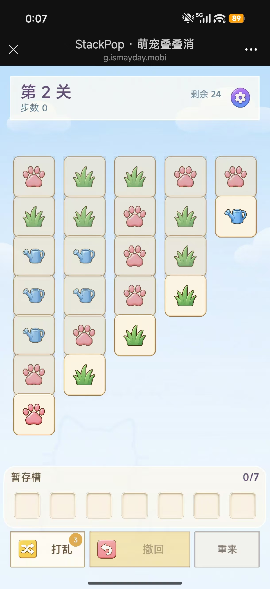

# StackPop UI 整体评估与优化方案（iPhone 实测 V1）

> 日期：2026-08-23  
> 用途：供 Kevin、Claude、Codex 讨论下一轮 UI 改造范围，不是已经批准的执行规格。  
> 审计模式：游戏主界面 UX + 视觉层级 + 可访问性联合评估。  
> 证据：用户提供的手机内置浏览器、第 2 关、步数 0、空暂存槽截图；同时核对当前实现代码和既有美术规格。

## 0. 结论先行

当前版本已经从“功能原型”进入“可正常游玩”的阶段：画面清晰，核心区域齐全，
暂存槽与按钮主次也比上一轮明显进步。现在最需要解决的已经不是大布局错误，而是
**素材被二次缩小、组件语言不统一、交互状态仍像调试界面**，因此整体观感仍停留在
“验证版”，没有完全达到休闲成品游戏的精致度。

本轮建议不要先改关卡规格、棋盘尺寸或美术原文件。优先做一轮**代码层视觉校正**：

1. 修复 Tile 图案被二次缩小的问题；
2. 简化 Tray 内卡牌表现，避免“槽里再套一张小卡”；
3. 修正不可用的撤回按钮仍占据最强视觉位的问题；
4. 统一 HUD、Tray、按钮的圆角、描边、阴影和字体层级；
5. 再用两张布局对比图决定是否改变卡列的生长方向或基线。

这五项中，前四项不改变规则、不改变关卡数据，风险低、视觉收益最高。

---

## 1. 审计范围

### 1.1 用户目标

玩家进入关卡后，应在 1 秒内看懂：

1. 哪些卡牌现在可以点击；
2. 点击后卡牌会进入哪里；
3. 暂存槽还有多少空间；
4. 当前最重要、可执行的辅助操作是什么。

视觉目标是“软萌、轻松、可信赖的休闲游戏”，而不是工具型面板或卡牌数据表。

### 1.2 本次步骤

| 步骤 | 状态 | 健康度 |
| --- | --- | --- |
| 1. 进入第 2 关，步数 0，观察初始棋盘与操作区 | 已获得完整真机截图 | **可用，但视觉完成度不足** |

### 1.3 证据截图



截图文件：`docs/audit-assets/01-iphone-level2-gameplay-20260823.jpg`  
原图尺寸：1220 × 2656，保存副本与用户附件 SHA-256 一致。

> 顶部黑色标题栏属于手机内置浏览器，不属于游戏 UI，本次不将其计为应用缺陷。

---

## 2. 已经做对的部分

### 2.1 清晰度已经合格

标题、卡框和图案边缘清晰，之前 DPR 导致的模糊问题在这张截图里没有复现。
当前改造不应再触碰渲染倍率方案。

### 2.2 主要区域已经稳定

- HUD、棋盘、暂存槽、工具栏均完整可见；
- Tray 和工具栏没有被底部 Home Indicator 遮挡；
- 棋盘上下空白基本均衡，上一轮“越玩越空”的问题已经得到缓解；
- 暂存槽有独立奶油底板，已经能被识别为一个区域；
- 打乱、撤回、重来已出现基础主次关系，重来按钮也被弱化。

### 2.3 可点牌已有初步区分

每列最下方的可点击牌更亮，非可点击牌整体压暗。截图中玩家能够通过亮度推断
当前候选牌，说明上一轮 `alpha + overlay` 的方向有效。

### 2.4 触控尺寸总体安全

棋盘卡牌和底部工具按钮尺寸足够大。需要单独修的是设置按钮，其可见尺寸和实际命中区
当前只有约 34 CSS px，低于常用的 44px 手机触控建议。

---

## 3. 优先级总览

| ID | 问题 | 类型 | 优先级 | 建议阶段 |
| --- | --- | --- | --- | --- |
| UI-P0-1 | 图案素材被代码二次缩小，实际只占 Tile 约 47.6% | 明确实现错误 | **P0** | R1 |
| UI-P0-2 | Tray 中的牌还会再套一层小 Tile，核心信息会更小 | 明确实现错误 | **P0** | R1 |
| UI-P0-3 | 撤回不可用时仍保留黄色主按钮底色 | 状态层级 | **P0** | R1 |
| UI-P1-1 | HUD、Tray、工具按钮不是同一套组件语言 | 视觉系统 | P1 | R1 |
| UI-P1-2 | 卡列更像纵向表格，不像有前后关系的牌堆 | 玩法表达 | P1 | R2 原型决策 |
| UI-P1-3 | HUD 文案与字体仍有明显原型感 | 信息层级 | P1 | R1 |
| UI-P1-4 | 背景被额外白色 wash 冲淡，画面缺少场景感 | 氛围 | P1 | R1/R2 |
| UI-P1-5 | 设置按钮命中区偏小，部分文字对比度有风险 | 可访问性 | P1 | R1 |
| UI-P2-1 | Tray 压力变化主要依赖颜色和动画 | 状态反馈 | P2 | R2 |
| UI-P2-2 | Canvas 缺少屏幕阅读器/键盘的替代表达 | 可访问性工程 | P2 | 后续专项 |

---

## 4. P0：建议直接进入下一轮的修正

## 4.1 UI-P0-1：Tile 图案被二次缩小

### 截图表现

爪子、草和水壶在卡框中央显得偏小，卡片留白过多。图案本身质量合格，但没有形成
应有的识别冲击力，因此整片棋盘看起来像“很多大空框里放着小贴纸”。

### 代码与素材证据

8 张 Tile 素材的透明边界实测均严格占 256px 画布的 **68%**，符合 MA1 的美术工单。

但棋盘渲染又执行了：

```ts
// GameScene.ts:262-264
icon.setDisplaySize(size * 0.7, size * 0.7);
```

所以最终图案主体最大占比是：

```text
素材主体 68% × 渲染尺寸 70% = Tile 的 47.6%
```

而策划 §20 的目标是 **62%~72%**。这不是美术尺寸问题，是代码把已经留好安全边距的
透明图再次缩小了一次。

### 建议

- 棋盘图案画布渲染到 `size * 0.94 ~ 1.00`；
- 第一版直接测 `1.00`，此时主体正好约占 68%；
- 不修改 8 张 Tile 原文件；
- 同时截取 5 列和 6 列、最小 48px Tile 做 32px 眯眼测试。

### 验收

- 图案主体占卡框 62%~68%；
- 8 种图案在最小 Tile 下 1 秒内可区分；
- bell、flowerpot、fish/bone 的亮度与轮廓差仍成立；
- 图案不碰到 tile_frame 内沿。

## 4.2 UI-P0-2：Tray 内卡牌存在“三次缩放”

### 代码证据

Tray 当前先缩进 9%，再把图案画布缩到内层 Tile 的 72%：

```text
Tray 内框 82% × 图案画布 72% × 素材主体 68% ≈ 槽位的 40.1%
```

这会让 Tray 中真正需要快速辨认的图案，比棋盘图案还小。并且 Tray 槽本身已有内凹框，
再放一个 `tile_frame` 会形成“槽里套卡、卡里再放小图”的多重边框。

### 建议

- Tray 中不再叠加完整 `tile_frame`；
- 直接把图案放进 `tray_slot`，图案画布渲染到槽位的 `0.88 ~ 0.92`；
- 保留 4%~6% 的轻微下落缩放或阴影，用于表达“这张牌已经进入 Tray”；
- 三消时直接对 3 个图案做聚拢、缩小、粒子消失，不要连三层框一起动画。

### 验收

- Tray 中图案主体占槽位约 56%~62%；
- 棋盘 → Tray 的飞行动画结束后，图案不会突然缩成一半；
- 5/7、6/7 状态下仍可在 1 秒内盘点已有类型。

## 4.3 UI-P0-3：不可用的撤回仍是视觉主按钮

### 截图表现

步数 0 时撤回不可用，但屏幕底部最大、最亮的黄色区域仍然是“撤回”。玩家第一眼会被
吸引到一个不能点击的按钮，容易误判为页面没有响应或按钮损坏。

### 根因

`drawToolButton()` 先按 `variant='primary'` 固定黄色填充，再只把 disabled alpha 降到 0.55。
也就是说“语义不可用”没有改变“视觉优先级”。

### 建议

| 状态 | 撤回表现 |
| --- | --- |
| 无撤回记录 | 与重来同级的中性浅灰/奶油描边，图标与文字低饱和 |
| 有撤回记录 | 切换为黄色实心主按钮，图标恢复粉色，120ms 轻微亮起 |
| 正在动画 | 保持禁用，显示处理中状态但不改变整体宽度 |

禁用时仍应保留按钮位置，避免布局跳动；只切换视觉 token 和交互状态。

---

## 5. P1：完成度与玩法表达

## 5.1 UI-P1-1：建立一套统一的“软萌表面”组件语言

目前同一屏上存在：

- HUD：硬直角半透明白框；
- Tray：16px 圆角奶油底板；
- 工具按钮：直角、明显描边；
- Tile：圆角、棕边、内外阴影；
- 设置：高饱和紫色圆形插画按钮。

单个组件都可用，但放在一起不像同一套 UI。

### 建议 token

| Token | 建议值 | 用途 |
| --- | --- | --- |
| `surfaceCream` | `#FFF8E9`，88%~94% | HUD、Tray |
| `surfaceRadius` | 16px | HUD、Tray |
| `buttonRadius` | 12px | 工具按钮、弹窗按钮 |
| `surfaceStroke` | 白色 1.5px / 70% | 大面板高光边 |
| `controlStroke` | 棕色 1.5px / 55% | 可交互按钮 |
| `shadowSoft` | 蓝灰 12%，Y=3px，blur=10px | HUD、Tray、可点 Tile |
| `textPrimary` | 现有紫/深棕 | 标题、重要数字 |
| `textSecondary` | 加深后的蓝灰 | 步数、剩余牌数 |

HUD、Tray、工具按钮应共享 token，不应各自在 Scene 内临时选颜色。

## 5.2 UI-P1-2：卡列更像表格，不像牌堆

当前 `rowStep = tileSize * 0.85`，每张牌绝大部分完整可见，再加上所有卡框的完整边界，
视觉上形成了五列整齐方格。玩家能看懂数量，但“牌压着牌、取走一张暴露下一张”的
空间关系不够强。

这里不建议立即改 `OVERLAP_RATIO`，而是先出两张真实关卡原型对比：

### 方案 A：保留当前方向，强化层级（低风险）

- 保持现有坐标和 0.85；
- 被覆盖牌不要把整张卡变脏，而是降低饱和度并减少投影；
- 可点击牌增加暖色外沿、2~3px 下投影和轻微抬起；
- 第 1~2 关前两步给可点击牌一次 600ms 呼吸提示。

### 方案 B：重新定义卡列基线（需用户测试）

当前不同深度的可点击牌形成明显阶梯，目标散落在不同高度。可做一个“可点击牌底部对齐”
版本，让牌堆统一从 Tray 上方向上延伸，五个当前目标落在同一视觉基线。

优点：扫描路径短、画面重心稳定，更像从一排牌堆取牌。  
风险：与当前“列向下生长、点最下方”的教学形成变化，需要同步玩法说明并重新测试。

> 讨论建议：先用 L2、L10、L20 各出 A/B 两张截图，不要直接改正式布局。

## 5.3 UI-P1-3：HUD 需要从“信息框”变成“游戏状态条”

截图中的 `第 2 关` 带有不自然的中文空格，字号和面板留白使它像调试标题。
“剩余 24”和设置按钮也略拥挤。

### 推荐结构

```text
╭──────────────────────────────╮
│ 第2关                         │
│ 步数 0              剩余 24张  ⚙ │
╰──────────────────────────────╯
```

- 文案改成 `第2关`，不在中文数字两侧插空格；
- 关卡标题从 24px 调到 21~22px；
- `剩余 24` 补足量词为 `剩余 24张`，或做成独立数字 pill；
- 设置图案可保持 34px，但透明命中区扩到 48×48px；
- HUD 使用与 Tray 一致的 16px 圆角和轻投影；
- 设置与剩余数字之间至少保留 12px 视觉间距。

## 5.4 UI-P1-4：背景被洗得过淡

截图下半部的花园/宠物水印几乎不可见，背景只剩浅蓝色。当前代码在背景图上又叠加了
顶部 8%、底部 28% 的 wash，导致已经很淡的美术再次失去对比。

建议先做代码对比，不重画背景：

- A：保持现状 `0.08 → 0.28`；
- B：改为 `0.04 → 0.14`；
- C：仅棋盘背后加局部柔光，不洗整个屏幕。

推荐先试 B。目标不是增加复杂细节，而是让用户感觉自己在“花园场景”里，而不是一张
空白蓝色画布上操作方格。

## 5.5 UI-P1-5：可访问性风险

### 截图与代码可确认

- 设置按钮实际交互区约 34px，建议扩到 48px；
- `#6E8CA0` 在不透明奶油底上的理论对比度约 3.43:1，13px 的“剩余”文字偏低；
- `#887A70` 在浅灰重来按钮上的理论对比度约 3.65:1，也低于普通文字 4.5:1 目标；
- 可点击/不可点击牌目前主要依赖亮度，建议再加入投影或外沿，不只依赖颜色。

### 建议

- 普通文字目标对比度 ≥ 4.5:1，大号文字 ≥ 3:1；
- 设置点击区 ≥ 44×44px，推荐 48×48px；
- 5/7、6/7 除颜色外，加入 `注意 5/7`、`危险 6/7` 或警示符号；
- 提供“减少动态效果”策略：关闭无限呼吸、摇晃改为一次性状态变化。

---

## 6. Tray 与工具区的目标形态

```text
╭────────────────────────────────╮
│ 暂存槽                         0/7 │
│  [ ] [ ] [ ] [ ] [ ] [ ] [ ]    │
╰────────────────────────────────╯

[ 打乱  ③ ]     [      撤回      ]     重来
  次操作          有记录时才高亮       低风险入口
```

细则：

- Tray 仍是底部视觉主区域，当前底板方向保留；
- 空槽保持安静，不需要每格强描边；
- 进入 Tray 的图案直接显示，不再套 `tile_frame`；
- 打乱次数角标保留，但与按钮右上角保持 6~8px 内边距；
- 重来仍保留二次确认，可进一步改成弱文字按钮；
- 工具按钮统一圆角，不再使用三块硬直角矩形。

---

## 7. 推荐实施拆分

## UI-R1：代码层视觉校正，不动规则、不重画素材

建议范围：

1. board icon 画布比例 `0.70 → 1.00`，再真机微调；
2. Tray 去掉二层 `tile_frame`，图案画布约 `0.90`；
3. disabled Undo 使用中性 token，enabled 才切黄色；
4. HUD 与工具按钮改为统一圆角、描边、阴影；
5. `第 2 关 → 第2关`，加深次级文字；
6. 设置图标命中区扩大到 48px；
7. 背景 wash 降到 `0.04 → 0.14` 候选；
8. 所有新增尺寸继续走 `px()` / `fontPx()`。

预期：不增加新网络素材，不改变关卡与布局计算，主要风险集中在视觉参数。

## UI-R2：卡列视觉方向与状态反馈

先产对比图再决定：

1. 当前基线 + 强化可点层级；
2. 可点击牌统一底部基线；
3. L2、L10、L20 三种深度截图；
4. 空 Tray、5/7、6/7、三消中四种状态；
5. 用户测试问题只问两件事：
   - “你会先点哪一张？”
   - “你觉得还能放几张？”

若 5 人中至少 4 人能在 1 秒内答对，再进入正式实现。

## UI-R3：氛围与高级动效（可选）

- 背景花园层次微调；
- 顶牌呼吸/抬起；
- Tray 还差 1 个提示；
- 5/7、6/7 风险升级；
- 胜负弹窗、星级与 BGM 音量联动。

R3 不应阻塞 R1。

---

## 8. 验收截图矩阵

下一轮不能只验一张首页或一张空 Tray。至少固定以下截图：

| 设备/视口 | 关卡状态 | 验收重点 |
| --- | --- | --- |
| 375×812 | L2，步数 0 | 图案占比、Undo disabled、HUD |
| 390×844 | L3，中局 | 不同深度、棋盘居中、Tray 2~4 张 |
| 414×760 | L10，中局 | 短可视区、底部安全区 |
| 430×932 | L17，Tray 5/7 | 压力提示与工具栏 |
| 375×812 | 任意关，Tray 6/7 | 非颜色警示、呼吸效果 |
| 375×812 | 重来确认 | 危险操作层级 |
| 375×812 | 胜利/失败 | 弹窗、背景降噪、按钮层级 |
| 桌面 1280×720 | L10 | 限宽、hover、鼠标光标 |

每张都应同时检查：

- 32px 眯眼辨识；
- 1 秒可点牌识别；
- 1 秒 Tray 余量识别；
- 字体清晰度；
- safe-area 与浏览器工具栏；
- 视觉状态与真实 enabled/disabled 一致。

---

## 9. 工程红线与回归测试

1. 不修改 20 关 Tile 数、类型、列数、深度；
2. R1 不修改 `calculateGameLayout()` 和 6 列 ground truth `52.17 / 44.34`；
3. 若 R2 改坐标方向，必须增加每列可点击 Tile 的位置测试；
4. Tile 有效主体占比增加自动检查：素材 bbox 68%，渲染后目标 62%~68%；
5. Tray 图案不得再次出现三层缩放；
6. disabled 主按钮不得继续使用 primary fill；
7. 所有 Scene 字号继续受 `stackpop-ui/require-scaled-font-size` 约束；
8. 不新增首屏图片；如新增背景版本，文件名必须升级版本号；
9. BGM 继续保持 deferred load，不得因 UI 改造回到首屏关键路径；
10. 完成后跑 lint / test / build，并用真机截图矩阵复验。

---

## 10. 需要 Kevin + Claude 定夺的 4 个问题

### D1：Tile 图案是否按素材原始 68% 占比显示？

**建议：是。** 这是规格恢复，不是风格重做。

### D2：Tray 中是否取消二层 tile_frame？

**建议：是。** Tray 本身已经是容器，图案直接进入槽位会更清楚。

### D3：卡列是否改为“可点击牌统一底部基线”？

**建议：先出 A/B 图，不直接改。** 这是本轮唯一可能影响玩家空间心智的决策。

### D4：是否重画背景？

**建议：暂不重画。** 先降低代码 wash；若花园氛围仍不足，再开 MA4 背景微调工单。

---

## 11. 证据限制

本次只有一张“L2、步数 0、空 Tray”的手机截图，因此以下内容尚未被截图直接验证：

- 取牌、三消、Tray 位移动画是否顺滑；
- 5/7、6/7、满槽的警示是否足够；
- 撤回启用后的视觉是否自然；
- 重来确认、胜负弹窗、设置页的一致性；
- 横屏、桌面、短屏和小屏状态；
- 屏幕阅读器、键盘、减少动态效果；
- BGM 与点击音效的主观音量平衡。

因此本文可以作为下一轮设计讨论与实施范围，但不能视为全流程可访问性合规结论。

---

# 12. 决策与验收（Kevin + Claude，2026-08-23）

## 12.1 Claude 复核结论

**方案通过，核心诊断属实。** 逐项复核如下：

| Codex 声称 | 我的独立复核 |
|---|---|
| 素材主体占框 68% | 8 张实测 **67.97%** ✅（MA1 验收数据） |
| 棋盘图案占卡牌 47.6% | `68% × 0.70 = 47.6%` **逐位吻合** ✅ |
| Tray 图案占槽位 40.1% | `68% × 0.72 × 0.82 = 40.1%` **逐位吻合** ✅ |
| 低于策划目标 | §1270 明确 **62~72%**，当前 47.6% 确实低于下限 ✅ |
| disabled 撤回仍是主按钮 | `GameScene.ts:395` `fill` 只看 `variant` 不看 `enabled` ✅ |

**补充验证（Codex 未做）**：`tile_frame` 安全区实测 **206px**。
按建议改到 `size * 1.00` 时主体 174px，**余量 32px，不会压到描边** ✅。
这正是 MA1 要求素材做成 68% 的原因——它本就是为 1:1 绘制设计的。

离线合成对比（52px 真机尺寸）确认：47.6% 是「大空框里放小贴纸」，
68% 后图案有实体感，可辨识度明显提升。**这是本轮性价比最高的一项。**

## 12.2 四个问题的决定

| | 问题 | 决定 |
|---|---|---|
| **D1** | Tile 按素材原始 68% 显示 | ✅ **是**（规格恢复，非风格重做） |
| **D2** | Tray 取消二层 `tile_frame` | ✅ **是** |
| **D3** | 卡列改「可点击牌统一底部基线」 | ✅ **直接改**（Kevin 决定，不做 A/B 前置） |
| **D4** | 重画背景 | ❌ **暂不**，先降代码 wash |

### D3 说明：跳过 A/B 的风险与要求

Codex 原建议「先出 A/B 图再定」，Kevin 决定**直接采用底部基线**。
该决定已知悉以下风险，实现时必须处理：

1. **当前实现是从 `boardTop` 向下排布**（`GameScene.ts:242-243`），
   可点牌在**列尾**，列高随取牌从下方缩短。
   改为底部基线 = 把**列尾锚定在固定基线**、向上生长。
2. **这会反转「牌堆消长」的视觉方向**，是本轮唯一影响空间心智的改动。
3. 因此**必须补测试**：每列可点击 Tile 的坐标与命中区
   （§9 红线第 3 条已要求，现由「若改」变为「必须」）。
4. 上线后若玩家反馈「不知道点哪张」，此项**优先回滚**，
   R1 其余 7 项不受影响——实现时应保证该项可独立还原。

## 12.3 执行分工

**R1 交 Codex 实现**，完成后 Claude 按 §9 红线验收。

R1 范围以 §7 的 8 项为准，**加上 D3 的底部基线改造**。

## 12.4 验收硬门槛（Claude 将逐条核对）

除 §9 十条红线外，以下为**量化门槛**，不达标即打回：

| # | 门槛 | 判定方式 |
|---|---|---|
| 1 | 棋盘图案占卡牌 **62%~68%** | 读代码倍率 × 67.97% 计算 |
| 2 | 主体不越 `tile_frame` 安全区 **206px** | 按渲染尺寸折算校验 |
| 3 | Tray **不得有三层缩放** | 源码检查 `createTrayTile` |
| 4 | 6 列 ground truth **52.17 / 44.34** | 布局单测，逐位相同 |
| 5 | disabled 按钮**不得用 primary fill** | 源码 + 反向验证测试 |
| 6 | 8 图案 **32px 眯眼可辨** | 离线合成 + 真机截图 |
| 7 | 每列可点 Tile **坐标/命中区有测试** | 新增测试且反向验证会红 |
| 8 | lint / test / build 全绿 | 自行重跑，不采信报告 |

> ⚠️ §11 已说明本轮证据仅一张「L2 步数 0 空 Tray」截图。
> **R1 完成后必须补齐 §8 截图矩阵**，尤其是 Tray 5/7、6/7、
> 胜负弹窗与桌面 1280×720——这些状态目前**从未被真机验证过**。
